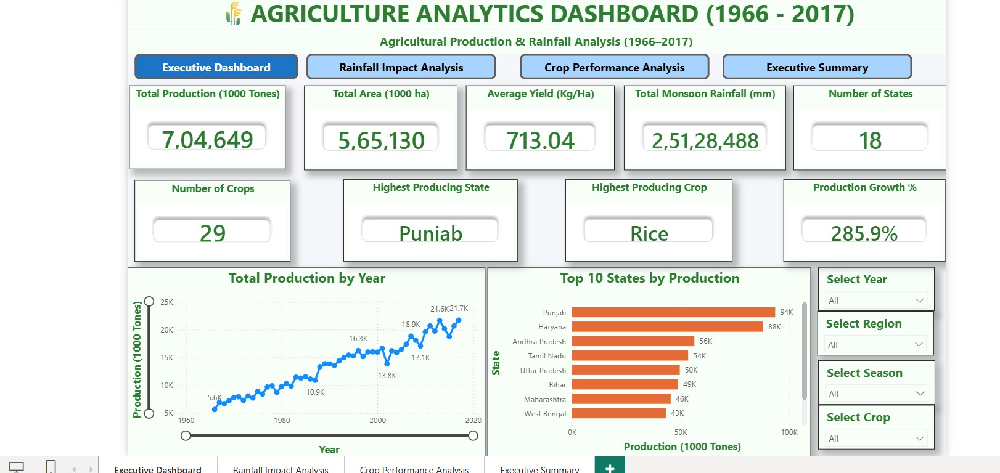
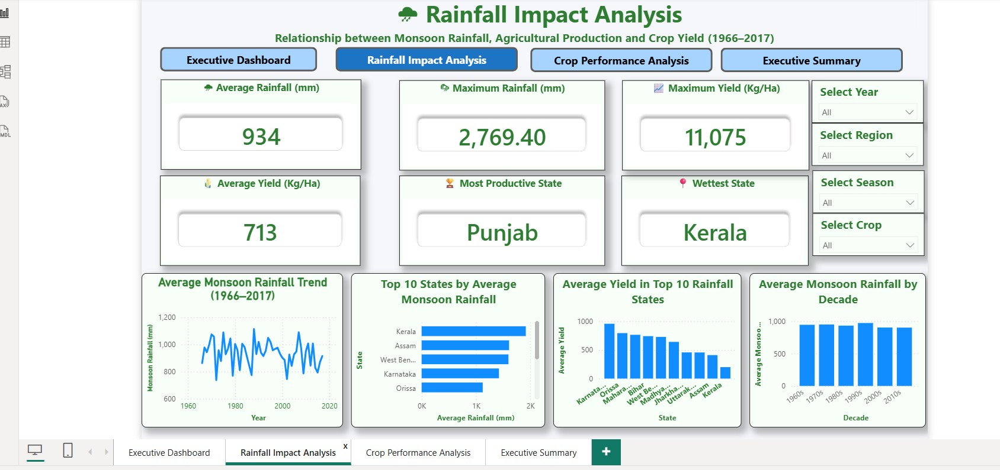
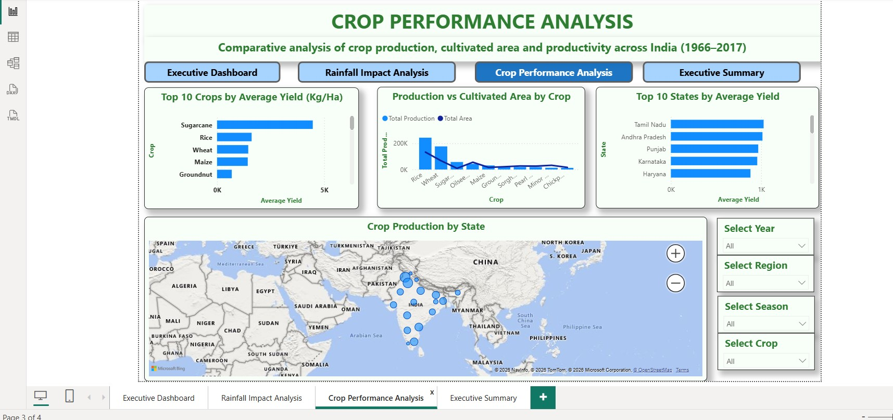

# 🌾 Agriculture Analytics Dashboard

## 📊 Agricultural Production, Crop Performance & Rainfall Analysis — India (1966–2017)

An interactive **Power BI dashboard** developed to analyse agricultural production, cultivated area, crop productivity and monsoon rainfall across Indian states and crops over the period **1966–2017**.

The project combines data transformation, DAX calculations and interactive visualisation to convert agricultural data into meaningful analytical insights.

---

## 🎯 Project Objective

The objective of this project is to explore agricultural trends and answer key analytical questions such as:

- How has agricultural production changed over time?
- Which states contribute the most to agricultural production?
- Which crops have the highest average yield?
- How does cultivated area relate to total production?
- Which states receive the highest monsoon rainfall?
- How does rainfall vary across years and decades?
- How does crop productivity vary between states?
- What relationships can be observed between rainfall, production and yield?

---

## 🛠️ Tools & Technologies

| Tool | Purpose |
|---|---|
| **Microsoft Power BI** | Dashboard development and data visualisation |
| **Power Query** | Data cleaning and transformation |
| **DAX** | Measures, calculations and KPIs |
| **Microsoft Excel** | Source data and data preparation |

---

## 📁 Dataset

The analysis covers agricultural data for India from **1966 to 2017**.

The dataset contains information relating to:

- State
- Crop
- Year
- Season
- Cultivated Area
- Crop Production
- Crop Yield
- Monsoon Rainfall

The data was transformed and modelled in Power BI before developing the analytical dashboards.

---

# 📈 Dashboard Pages

The report contains four analytical pages:

### 1. Executive Dashboard

Provides a high-level overview of agricultural performance.

Key indicators include:

- Total Production
- Total Cultivated Area
- Average Yield
- Total Monsoon Rainfall
- Number of States
- Number of Crops
- Highest Producing State
- Highest Producing Crop
- Production Growth

The dashboard also provides:

- Production trend by year
- Top states by production
- Interactive Year, Region, Season and Crop filters

### Dashboard Preview



---

### 2. Rainfall Impact Analysis

This page explores the relationship between **monsoon rainfall, agricultural yield and state-level performance**.

Key analytical views include:

- Average Rainfall
- Maximum Rainfall
- Maximum Yield
- Average Yield
- Most Productive State
- Wettest State
- Average Rainfall Trend
- Top States by Average Monsoon Rainfall
- Average Yield across high-rainfall states
- Rainfall comparison by decade

### Dashboard Preview



---

### 3. Crop Performance Analysis

This page focuses on crop-level and state-level productivity.

Key views include:

- Top 10 Crops by Average Yield
- Production vs Cultivated Area by Crop
- Top 10 States by Average Yield
- Crop Production by State
- Interactive crop, season, region and year filtering

### Dashboard Preview



---

### 4. Executive Summary

The report also includes an executive summary designed to consolidate important findings and provide a concise view of the analysis.

---

# 🔍 Key Analytical Areas

## Agricultural Production

The dashboard tracks production trends across the period 1966–2017 and enables comparison between states and crops.

## Crop Productivity

Average yield is analysed to identify high-performing crops and states.

## Cultivated Area

The relationship between cultivated area and total production is explored across major crops.

## Rainfall

Monsoon rainfall is analysed across:

- States
- Years
- Decades

This helps explore how rainfall patterns relate to agricultural productivity.

## Geographic Analysis

State-level comparisons provide a geographical perspective of agricultural production, rainfall and yield.

---

# 📌 Interactive Features

The dashboard includes interactive filters for:

- 📅 Year
- 🗺️ Region
- 🌦️ Season
- 🌾 Crop

Users can dynamically change selections and explore the data from different perspectives.

---

# 🧮 Data Analysis & DAX

The project uses Power BI measures and calculations to derive analytical KPIs such as:

- Total Production
- Total Cultivated Area
- Average Yield
- Average Rainfall
- Maximum Rainfall
- Maximum Yield
- Production Growth
- State and Crop rankings

These calculations support the interactive visuals and KPI cards throughout the report.

---

# 💡 Analytical Insights

The dashboard enables users to identify patterns such as:

- Rice emerging as a major contributor to agricultural production.
- Punjab and other high-producing states contributing significantly to overall production.
- Significant differences in crop productivity across states.
- Kerala and other high-rainfall states showing distinctive rainfall patterns.
- Variation in rainfall across years and decades.
- Differences between cultivated area and production efficiency across crops.

> **Note:** These observations are based on the dataset and dashboard calculations and should be interpreted within the scope and limitations of the source data.

---

# 🧠 Skills Demonstrated

This project demonstrates practical experience in:

- Data Cleaning
- Data Transformation
- Data Modelling
- Power Query
- DAX
- KPI Development
- Data Visualisation
- Dashboard Design
- Interactive Reporting
- Trend Analysis
- Comparative Analysis
- Business Intelligence
- Data Storytelling

---

# 📂 Repository Contents

```text
power-bi-agriculture-analysis-assignment/
│
├── README.md
│
├── Agriculture_Production_Analysis.pbix
│
├── 01-dashboard-overview.jpg
├── 02-rainfall-impact-analysis.jpg
└── 03-crop-performance-analysis.jpg
